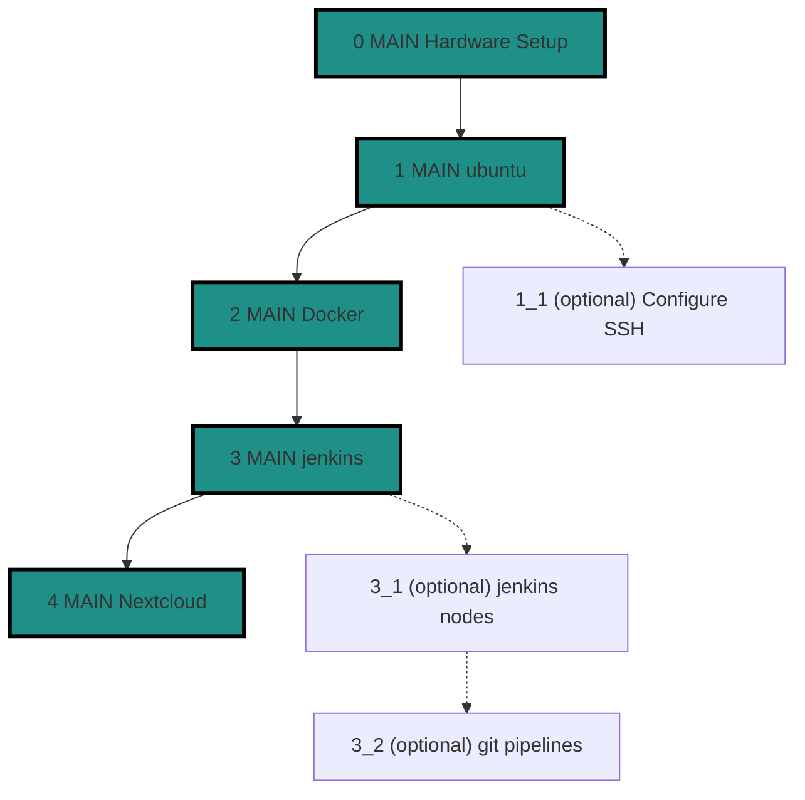

# Step 0 - Hardware and Preparations

- get the target machine: e.g. Dell Latitude E6230
- admin machine from where you work normally
- charger for said notebook
- a USB Stick (8GB or more)
- a mouse for setup (optional)

# Step 1 - Install ubuntu
## Step 1_1 - Configure SSH

# Step 2 - Install docker

# Step 3 - Install jenkins

# Step 3_1 - Register Jenkins Nodes

# Step 4 - Setup Nextcloud 
