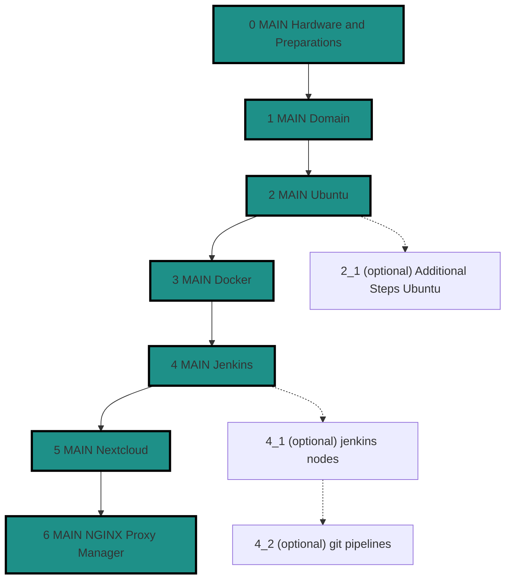

# Introduction
This Repo has begun as companion Repo for the 38c3 talk ["Decentralize your Internet with Self Hosting"](https://cfp.cccv.de/38c3-community-stages/talk/NUMFZU/).  
It aims to offer a step-by-step guide, how to setup a linux server, including hosting and automation infastructure (docker, Jenkins).  
We will show how to create your own domain and host your own nextcloud as self hosted online file sharing and collaboration platform.  
Of course, this is only the beginning. Starting with this setup, you are ready to self host a very diverse variety of platforms and tools.

But let's start with the plan on how to setup your machine and start configuring your nextcloud. Here is the plan:  

- [Step 0 - Hardware and Preparations](/detail_guides/0-hardware-preparations.md)
    - What to consider before you start
- [Step 1 - Register a cool domain](/detail_guides/1-domain.md)
    - Choosing a cool domain name will probably take the longest time
- [Step 2 - Install ubuntu](/detail_guides/2-install-ubuntu.md)
    - Install the OS which will power your server
- [Step 3 - Install docker](/detail_guides/3-install-docker.md)
    - Setup the basic infrastructure to keep your applications separated and tidied up
- [Step 4 - Install jenkins](/detail_guides/4-install-jenkins.md)
    - Tool to automate the boring tasks
- [Step 5 - Setup Nextcloud](/detail_guides/5-setup_nextcloud.md)
    - And here finally comes the magic. Set up that platform!
- [Step 6 - Configure NGINX Proxy Manager](/detail_guides/6-nginx-proxy-manager.md)
    - Creating yourself a certificate and routing traffic 
