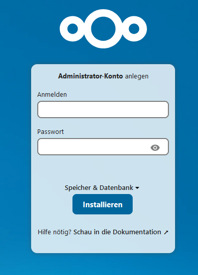
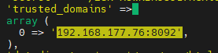
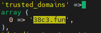

# Step 5 - Setup Nextcloud 

## Run Docker containers
- copy the git repository to your target machine
```bash
/home/cloudy
git clone git@github.com:hackerbande-nbg/decentralize-your-internet.git
```
- do some prep work, go to the nextcloud folder, make a copy of the env file and edit it
```bash
cd /home/cloudy
cd scripts/step_5
prep_nextcloud_env.sh
```
- replace the password (POSTGRES_PW) with a password of your choice
  - ATTENTION it seems important to make it not too complicated, this cost me a whi
  le to figure out. I was lucky with a 25 character long password, containing lower, upper case and numbers. No special characters.
- replace the project name (PROJECT) with a name of your choice
- start the nextcloud containers:
  ```bash
  docker compose up -d
  ```
  - note down the container name of the 3 created containers, in this case: 38c3.fun_app_nginx_proxy_manager, 38c3.fun_db_postgres + 38c3.fun_app_nextcloud. 
  
    ```bash
      [+] Running 13/13
      ✔ Network 38c3.fun_nw_public                         Created                                                            0.2s
      ✔ Network nextcloud_default                          Created                                                            0.2s
      ✔ Network 38c3.fun_nw_private                        Created                                                            0.2s
      ✔ Volume "38c3.fun_nginx_proxy_manager_letsencrypt"  Created                                                            0.0s
      ✔ Volume "38c3.fun_nextcloud_core"                   Created                                                            0.0s
      ✔ Volume "38c3.fun_nextcloud_apps"                   Created                                                            0.0s
      ✔ Volume "38c3.fun_nextcloud_config"                 Created                                                            0.0s
      ✔ Volume "38c3.fun_nextcloud_themes"                 Created                                                            0.0s
      ✔ Volume "38c3.fun_db_postgres_data"                 Created                                                            0.0s
      ✔ Volume "38c3.fun_nginx_proxy_manager_data"         Created                                                            0.0s
      ✔ Container 38c3.fun_app_nginx_proxy_manager         Started                                                            3.6s
      ✔ Container 38c3.fun_db_postgres                     Started                                                            3.3s
      ✔ Container 38c3.fun_app_nextcloud                   Started                                                            4.9s
    ```
    You can also find the container names later with 
    ```bash
    docker ps
    ```

## Configure nextcloud
- On your admin machine, open a browser and browse to http://<target machine IP>:8092
  - Nextcloud Setup Screen should show up:  
     
- Choose an admin login and password of your choice
- Expand "Storage and Database":
  - Storage Directory: Keep Default
  - Setup Database: Toggle "PostgreSQL"
  - Database Account: postgres
  - Database Password: Enter the one you chose in [Step 7](#step-7---run-nextcloud) as POSTGRES_PW
  - Database Name: postgres
  - Database Host: <postgres container name from [Step 7](#step-7---run-nextcloud)>:5433
- Click on "Install"
  - Button should switch to "Installing" - patience!
- On the next page click "Install recommended Apps" or make a choice 

## Nextcloud setup trusted domain
Nextcloud will check if you are accessing it from the same domain, like you set it up from in the beginning.
If you changed this domain later (e.g. because you set it up before configuring internet access and now you want to access it not via local IP, but via a real domain) an internal config needs to be changed.

Here is one way to do it.
- Identify your nextcloud config volume:  
    ```docker volume ls```
- spin up a temporary docker container, which has nano, mount the config volume and edit it:  
    ```docker run --rm -it -v 38c3.fun_nextcloud_config:/mnt/config ubuntu bash -c "apt-get update && apt-get install -y nano && nano /mnt/config/config.php"```
- in nano, change the item 0 of array "trusted domains" to your real domain:  
    - Before:  
    
    - After:   
    
- as we are already here, please also add the following line to config, it is required to get an A+ in security scan:  
``` 'overwriteprotocol' => 'https',```

Please note: If NGINX Proxy Manager is not yet fully configured, your external domain will not yet point to the nextcloud. So this setting will effectively lock you out of your nextcloud for now. Which is ok, but if you want to log in during this time, consider just adding both adresses, internal IP and external domain to the array of trusted domains.
