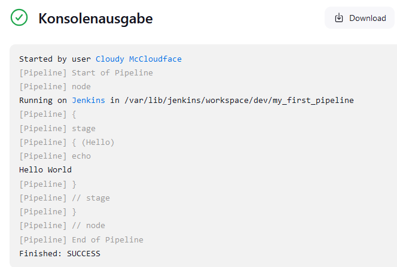

# Step 0 - Hardware and Preparations

- get the target machine: e.g. HP Pavillon 15-bc230ng
- admin  machine from where you work normally
- charger for said notebook
- a USB Stick (8GB or more)
- a mouse for setup (optional)

# Step 1 - Setup Ubuntu Boot Stick

## DL ubuntu
download 22.04 LTS latest version (https://ubuntu.com/download/server)

topics
- why ubuntu
- what is a boot stick
- disable secure boot
- what is LTS
- general ubuntu install manual

## Install rufus

- download rufus https://rufus.ie/en/ (version 4.6)
- run rufus.exe
- Rufus Update Policy --> Yes

## Run rufus

- Device: select your USB Stick (e.g. mine was on D:)
- be sure that you selected the correct stick or better, unplug all other USB sticks and disks
- Boot selection: Disk or ISO image (Please select)
- Select button: select the downloaded .iso file (ubuntu-24.04.1-live-server-amd64.iso)
- Partition scheme: MBR
- Target System: BIOS or UEFI
- Volume label: we-have-internet-at-home
- File system: FAT32
- Cluster size: 4096 bytes (Default)
- Push START
- ISOHybrid image detected: Write in ISO mode (recommended)
- Push OK
- Another Program is using this drive: Push Yes
- Warning: All data on device 'D:' will be destroyed: Push OK
- wait patiently (7 minutes for me)
- Push Close

topics
- what is a boot stick

# Step 2 - Install ubuntu

- insert the boot stick into the target machine
- boot the target machine
- find out your boot key, this depends on your hardware
  - here is a list for most manufacturers: https://www.disk-image.com/faq-bootmenu.htm
  - if you don't find your manufacturer, try in this order: F2, ESC, F10, F12, DEL, TAB 
  - use separate reboots
  - this is as stupid as it sounds
- start the machine
- frantically hit the boot key
- in the boot menu, select the boot stick  

- <details>
    <summary>Dell Latitude E6230</summary>
  For the Dell Latitude E6230 it was very important to boot the Ubuntu install USB stick already in UEFI mode (*not* Legacy Mode).
  To achieve this, it was necessary to boot to Bios Setup (Hit F2 during "Dell" Splash Screen), disable Legacy Boot Option, disable Secure Boot and *manually* add a UEFI Boot Option. It was not automatically in the boot sequence list. 

  - Add Option  
  - Navigate through the file selection list somewhere to a sub dir named grub2 and select the file inside.  
  - cannot remember anymore in detail unfortunately :(    
  </details> 

- select "Install ubuntu"
- select your language ("English")
- select your keyboard layout, via the identify option ("German")
- choose "Ubuntu Server" for base installation
- add a network connection
  - preferably via LAN
  - otherwise add wifi, although that leads to unstable setups
- test the update Archives
- Guided storage configuration: use the Default
- storage configuration: press Done
- start installation: Continue
- Profile configuration: add your name, your server name, your username, and your password
- remember your password
- Ubuntu ProSetup: skip
- SSH configuration: enable Install OpenSSH server
- Be patient once more. This can take a while, especially the "Installing Kernel" step.
- Reboot after install
- you successfully installed ubuntu!
- demo user: cloudy:cloudy
  - This creds only apply, if you chose them above under Profile Configuration
- update your machine:
```bash
sudo apt update && sudo apt upgrade -y
```
- Reboot machine:
```bash
sudo reboot now
```

topics:
- SSH --> later

# Step 3 - Set up your admin machine

## Install git

- download git for windows: https://git-scm.com/download/win
- run the installer
  - everything default EXCEPT adding a desktop shortcut
- License: click next
- Select Components: add a shortcut to your desktop
- default editor: notepad
- naming of initial branch: let git decide
- Adjust your PATH environment: use recommended option
- choosing SSH executable: Use bundled OpenSSH
- Choosing https transport backend: Use the OpenSSL library
- Configuring the line ending conversions: Checkout Windows-style, commit Unix-style line endings
- Configuring the terminal emulator to use with Git Bash: Use MinTTY
- Choosing the default behavior of `git pull`: fast-forward or merge
- Choose a credential helper: None
- Configuring experimental options: enable file system caching
- Click Install
- Do not view the release notes
- move to your home folder and download this repository
```bash
cd
mkdir git
git clone git@github.com:codingkrabbe/decentralize-your-internet.git
```

topics:
- git bash copy paste is weird

# Step 4 - install docker

- update your package manager and add docker repo [see script](scripts/step_4/add_docker_apt_repo.sh)
```bash
# Add Docker's official GPG key:
sudo apt-get update
sudo apt-get install ca-certificates curl
sudo install -m 0755 -d /etc/apt/keyrings
sudo curl -fsSL https://download.docker.com/linux/ubuntu/gpg -o /etc/apt/keyrings/docker.asc
sudo chmod a+r /etc/apt/keyrings/docker.asc

# Add the repository to Apt sources:
echo \
  "deb [arch=$(dpkg --print-architecture) signed-by=/etc/apt/keyrings/docker.asc] https://download.docker.com/linux/ubuntu \
  $(. /etc/os-release && echo "$VERSION_CODENAME") stable" | \
  sudo tee /etc/apt/sources.list.d/docker.list > /dev/null
sudo apt update
```
- install docker and put your user into the docker group (might need shell restart) [see script](scripts/step_4/install_docker.sh)
```bash
sudo apt install -y docker-ce docker-ce-cli containerd.io docker-buildx-plugin docker-compose-plugin
sudo usermod -aG docker $(whoami)
```
- test your installation
```bash
sudo docker run hello-world
```
Should pull the hello-world image from Docker Hub and show a lengthy "Hello from Docker! ..." message.

topics: 
- apt key

# Step 5 - install jenkins

- install jenkins (add keyring, add repository, install jenkins)
```bash
sudo wget -O /usr/share/keyrings/jenkins-keyring.asc \
    https://pkg.jenkins.io/debian-stable/jenkins.io-2023.key
echo "deb [signed-by=/usr/share/keyrings/jenkins-keyring.asc]" \
    https://pkg.jenkins.io/debian-stable binary/ | sudo tee \
    /etc/apt/sources.list.d/jenkins.list > /dev/null
sudo apt update
sudo apt install -y fontconfig openjdk-17-jre
sudo apt install -y jenkins
```
- find out your current ip
```bash
ip -4 addr show | grep -oP '(?<=inet\s)\d+(\.\d+){3}'
```
- on your admin machine, open your browser and go to http://<your-ip>:8080
- this will open the jenkins web interface
- copy the password from the console
```bash
sudo cat /var/lib/jenkins/secrets/initialAdminPassword
```
- type the password into the web interface
- you can now install plugins in jenkins
  - the default installation aims for developer setups
  - we don't need that, but it doesn't hurt
  - if you select yourself, the following are not needed:
    - ant, gradle, PAM authentication, LDAP authentication, matrix authorization
- click Install
- wait for the installation to finish
- add your admin user
  - username: clenkins
  - password: clenkins
  - full name: Cloudy McCloudface
  - email: none@cloudy.com (jenkins can send mails if things go south)
- Jenkins URL: Keep Default
- Instance Configuration: Save and Finish
- Start using Jenkins


topics:
- jenkins
- cicd
- nice plugins

# Step 6 - register machine as agent (so we can automatically run stuff)

- go to Jenkins --> Manage Jenkins --> Nodes
- click on "Built-In Node" (german: "Master")
- "Konfigurieren" -> add the label "server"
- you can now run jenkins jobs on this machine via labels
- test your setup with a jenkins pipeline
  - go to jenkins root
  - "New Item" --> Folder "prod"
  - "New Item" --> Folder "dev"
  - click on dev --> Create new Job --> Pipeline --> "my_first_pipeline"
  - go to the pipeline section
  - add the Hello World example from "try sample pipeline"
    <details>
        <summary>Hello World Pipeline</summary>

    ```groovy
    pipeline {
        agent any

        stages {
            stage('Hello') {
                steps {
                    echo 'Hello World'
                }
            }
        }
    }
    ```

    </details>
    - can also be found here: [step_6/pipeline_hello_world.groovy](scripts/step_6/pipeline_hello_world.groovy)
    - Click on "Build Now":  
    
    - Click on the Build Number, on the lower left, then on "Console Output":   
    


topics
- jenkins config as code
- pipelines as code
- jenkins only pulls, no push
- security architecture

# Step 7 - run nextcloud

- copy the git repository to your target machine
```bash
git clone git@github.com:codingkrabbe/decentralize-your-internet.git
```
- do some prep work, go to the nextcloud folder, make a copy of the env file and edit it
```bash
cd /home/cloudy
mkdir nextcloud_data
mkdir nextcloud_logs
mkdir nextcloud_ssl
mkdir nextcloud_html
cd decentralize-your-internet/infra/nextcloud
cp .env.example .env
nano .env
```
- replace the password (POSTGRES_PW) with a password of your choice
  - ATTENTION it seems important to make it not too complicated, this cost me a while to figure out. I was lucky with a 25 character long password, containing lower, upper case and numbers. No special characters.
- replace the project name (PROJECT) with a name of your choice
- start the nextcloud containers:
  ```bash
  docker compose up -d
  ```
  - note down the container name of the 2 created containers, in this case: 38c3.fun_db_postgres + 38c3.fun_app_nextcloud
  
    ```bash
    [+] Running 9/9
    ✔ Network 38c3.fun_nw_private         Created                                                                           0.6s
    ✔ Network 38c3.fun_nw_public          Created                                                                           0.2s
    ✔ Volume "38c3.fun_db_postgres_data"  Created                                                                           0.0s
    ✔ Volume "38c3.fun_nextcloud_core"    Created                                                                           0.0s
    ✔ Volume "38c3.fun_nextcloud_apps"    Created                                                                           0.0s
    ✔ Volume "38c3.fun_nextcloud_config"  Created                                                                           0.0s
    ✔ Volume "38c3.fun_nextcloud_themes"  Created                                                                           0.0s
    ✔ Container 38c3.fun_db_postgres      Started                                                                           2.3s
    ✔ Container 38c3.fun_app_nextcloud    Started                                                                           3.1s
    ```

  # Step 8 - Configure nextcloud
  - On your admin machine, open a browser and browse to http://<target machine IP>:8092
    - Nextcloud Setup Screen should show up 
  - Choose an admin login and password of your choice
  - Expand "Storage and Database":
    - Storage Directory: Keep Default
    - Setup Database: Toggle "PostgreSQL"
    - Database Account: postgres
    - Database Password: Enter the one you chose in [Step 7](#step-7---run-nextcloud) as POSTGRES_PW
    - Database Name: postgres
    - Database Host: <postgres container name from [Step 7](#step-7---run-nextcloud)>:5433
  - Click on "Install"
    - Button should switch to "Installing" - patience!
  - On the next page click "Install recommended Apps" or make a choice 


topics
- docker .env files
- passwords
- docker-compose
- current architecture